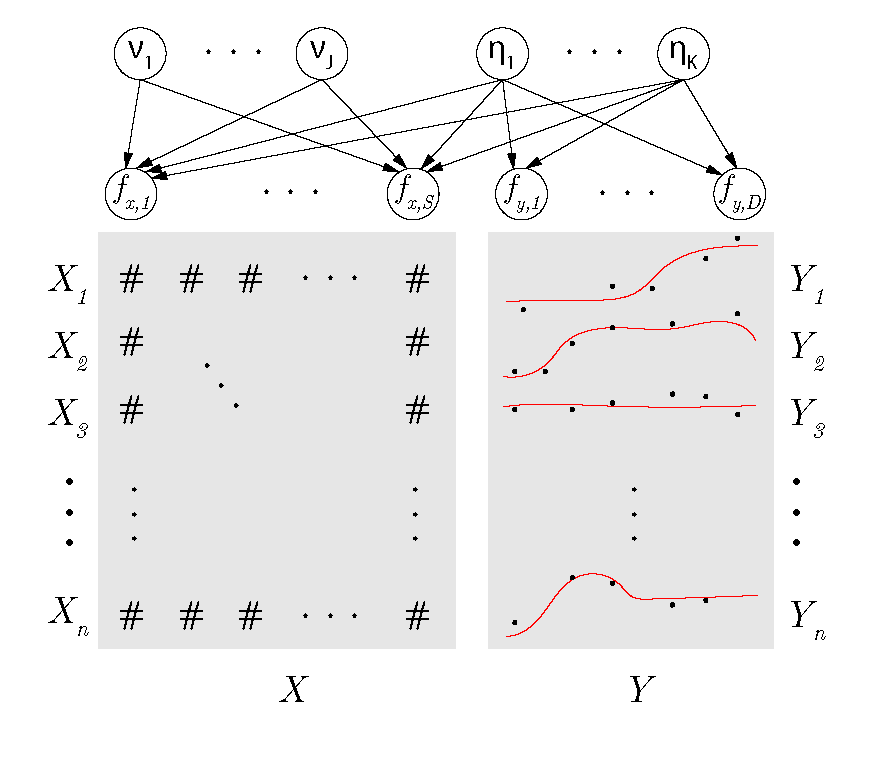

# About bs3fa

`bs3fa` is a package for Bayesian partially Supervised Sparse and Smooth Factor Analysis (BS<sup>3</sup>FA). This model is appropriate for data in which you have observations of functional Y and numeric (continuous, binary, count) data X. The model assumes all variation in Y is explained by some low-dimensional factors, and these factors also explain part (but not all) of the variation in X. This library can also be used when no 'supervising' X data are available and smooth unsupervised factor analysis is desired (see guide to what is contained in repository below).



# Installing the package

After downloading and installing **R** (if necessary) run the following from within **R**:
```
# Install packages required by bs3fa
install.packages(c("remotes", "Rcpp", "abind", "pracma", "sparseEigen", 
                   "mvtnorm", "gridExtra", "ggplot2")) 

# Install the bs3fa package
remotes::install_github("kelrenmor/bs3fa", quiet=T, upgrade=T, dependencies=T)
```

# What's in this repository

The [R](R) directory contains R functions available in this package, including `run_bs3fa()` (the main model sampler), `run_fpca()` (the sampler for Y-only smooth factor analysis), and the post-processing functions used to resolve rotational ambiguity.

The [src](src) directory contains cpp source code used for sampling specific parameters in the Gibbs sampler (i.e., this directory contains the sampling functions used within the sampler loop of `run_bs3fa()`) and the post-processing functions used to resolve label and sign switches.

The [demo](demo) directory contains a demo of the method using realistically simulated active chemicals, and continuous chemical features with sparsity in the toxicity-relevant loadings.

The [data](data) directory contains a cleaned set of samples from the ToxCast Attagene PXR assay measured at a common grid of dose values. It is used in the `simulate_data()` function if the user desires more realistic loading vectors be simulated.
